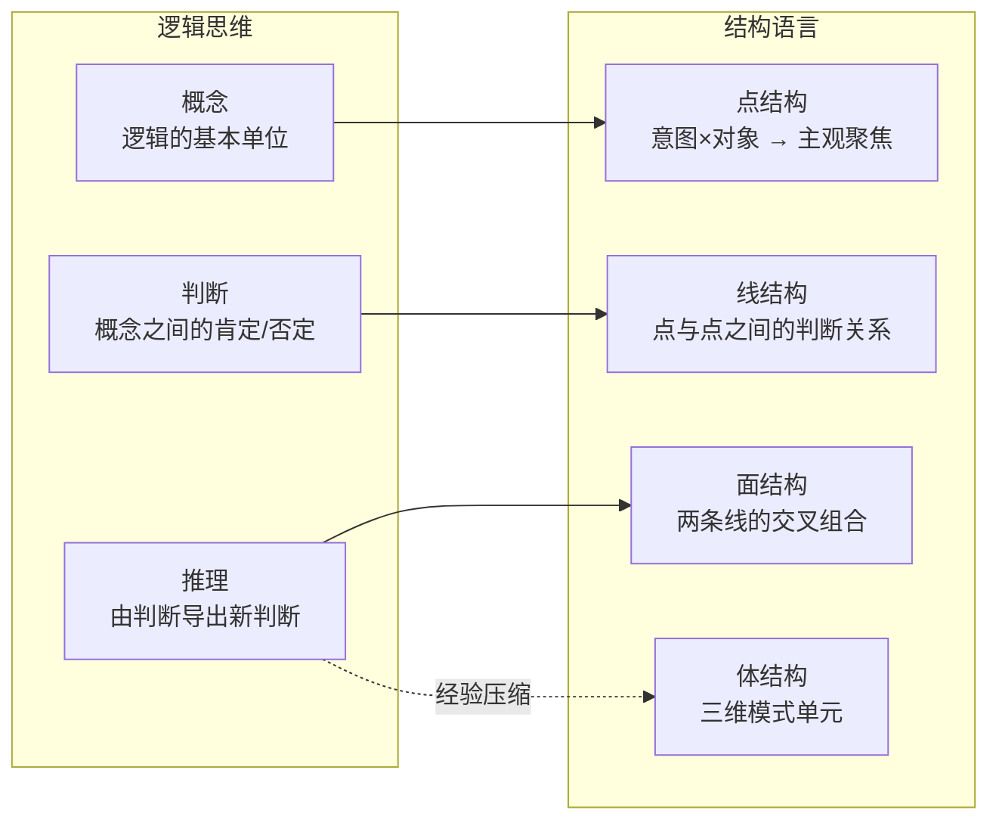

## 一、引子：逻辑思维的荣耀与局限

逻辑思维，常被称为“抽象思维”，是人类理性认识的核心工具。自亚里士多德以来，逻辑为哲学、数学与科学奠定了基础。它的三个基本特征广为人知：

- **确定性**：每一步推理都是明确的，不含糊。
    
- **条理性**：推理链条环环相扣，井然有序。
    
- **根据性**：每一个结论都由前提和理由支撑。
    

然而，逻辑并不能解释人类全部的思维。它要求前提固定，但真实世界却充满了突变与不确定。逻辑能保证形式正确，却未必保证现实真实。

---

## 二、逻辑三形式与结构语言的映射

逻辑的三大基本形式——概念、判断、推理——如果放到结构语言体系中，可以找到对应关系：

|逻辑思维|结构语言对应|说明|
|---|---|---|
|概念|**点结构**|意图 × 对象的主观聚焦点。例：看见草 → “能吃/不能吃”的点。|
|判断|**线结构**|点与点之间的正/负关系。例：“努力 → 成功”的一维判断。|
|推理|**面/体结构**|多条线交叉的模式组合，经验化后沉淀为“因果印象”。|

这说明：逻辑并不是独立的高塔，而是点—线—面的抽象子集。

---

## 三、逻辑的盲区：跳变与原点

逻辑要求在固定前提内运作，但真实局势往往会发生“跳变”：

- **维度跳变**：某一维度被重判，整体局面翻转。
    
- **原点跳变**：意图锚点切换，整个逻辑坐标系被替换。
    

案例：在“假狗退货事件”中，负责人最初态度是推诿（-），当我亮出“市长热线”的外部威胁后，他突然转为全力解决（+）。这不是逻辑链条能推演出来的，而是原点和权重发生了跳变。

---

## 四、逻辑的起源：经验与知识的沉积

逻辑并非“先验真理”，而是经验和知识的高阶压缩。

- **经验型结构**：来自个人直接经历的因果印象。
    
- **知识型结构**：通过叙事、教育传递的逻辑框架。
    
- **逻辑**：当经验与知识被反复强化，就沉淀为稳定的形式规则。
    

逻辑因此像是一种“认知压缩算法”：它高效，但依赖于前提的稳定性。

---

## 五、逻辑与结构语言的互补

- **逻辑思维**：擅长保证形式一致、推理严谨。
    
- **结构语言**：擅长揭示意图锚点、关系快照和跳变机制。
    

类比来说：

- 逻辑是**铁轨**，保证列车不会脱轨；
    
- 结构语言是**导航**，决定列车要开往哪里。
    

二者并非取代关系，而是嵌套关系。逻辑是结构语言中的子集，结构语言则是逻辑的生成机制。

---

## 六、实践价值

- **逻辑思维的应用**：数学证明、程序开发、制度设计。
    
- **结构语言的应用**：谈判、叙事控制、防骗识别、局势博弈。
    

举例：骗局往往通过制造“看似完美的正向局面”来迷惑人（A+Q+T+）。逻辑思维只能看到形式上的一致，而结构语言可以通过**极性翻转快照**验证：一旦假设原点为假，整个局面瞬间崩塌。这是逻辑无法做到的防御。

---

## 七、收束：未来的认知工具

逻辑不是被否定，而是被放回它应有的位置：

- 它是经验与知识的高级压缩工具；
    
- 它能保证形式正确，却无法保证前提不被颠覆。
    

结构语言为我们提供了更底层的观察工具：

- 显化逻辑的生成机制；
    
- 揭示前提如何因意图和局势而改变；
    
- 让我们在“逻辑链断裂”的地方依然有解。
    

一句话总结：**逻辑让我们在既有规则下前行，结构语言让我们在规则之外找到新的出路。**

---

- **概念 → 点结构**：逻辑的基本概念，其实就是在意图下压缩出的点。
    
- **判断 → 线结构**：逻辑中的肯定/否定，等同于点与点之间的正负关系。
    
- **推理 → 面/体结构**：逻辑的推理链，在结构语言里就是面/体的多维组合；经过经验压缩后，沉淀为“因果印象”。
