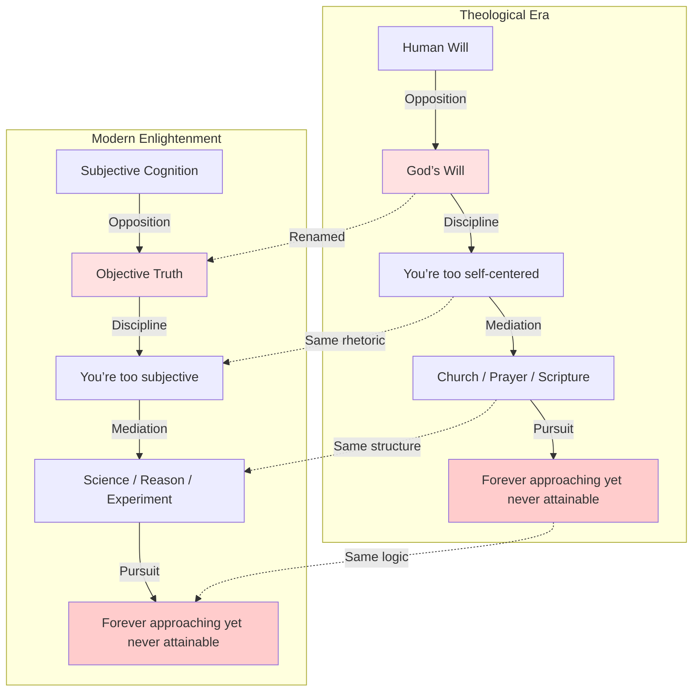
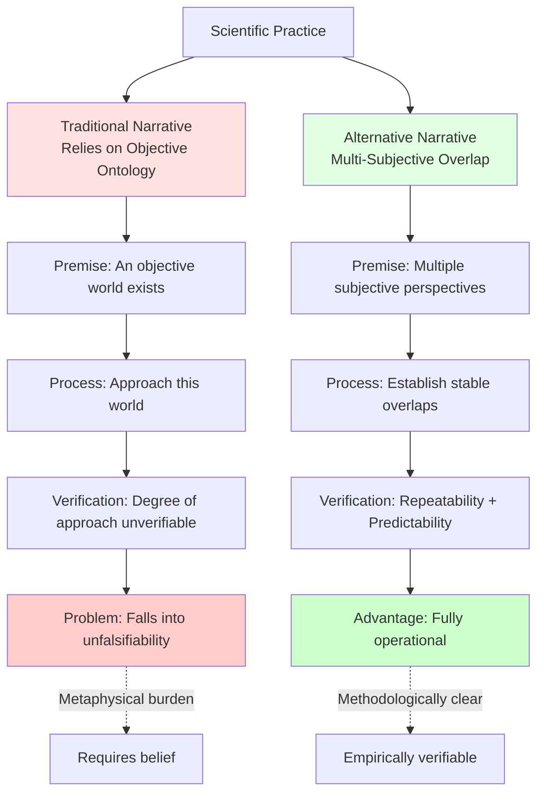
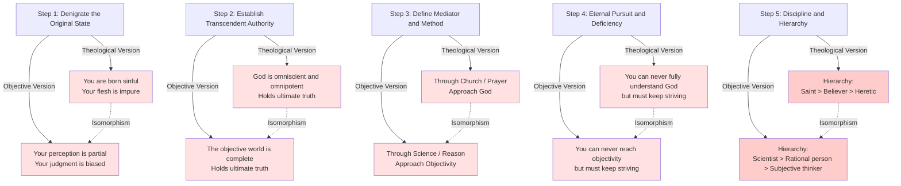

### 1. Structural Isomorphism Between Theology and Objectivity Worship

### 2. Two Narratives of Science Compared

### 3. The Five-Step Disciplinary Logic of Narratives

## Core Insights

1. **The Power Structure Remains Unchanged:** The Enlightenment merely replaced “God” with “objectivity”; the structure that suppresses individual experience persists.
    
2. **Critical Distinction:** Objective Ontology (metaphysical claim) vs. Standards of Objectivity (methodological criterion).
    
3. **Science Does Not Depend on Theology:** Repeatability, predictability, and operational validity do not require assuming an objective ontology.
    
4. **Return to the Origin:** Your direct experience is the most fundamental reality—it requires no transcendent authority for validation.
    
5. **Constructive Alternative:** Replace “objective ontology” with “multi-subjective overlap + stability criterion.”
    

This piece exposes the theological structure hidden within modern rational discourse—a profound critique of cognitive power.