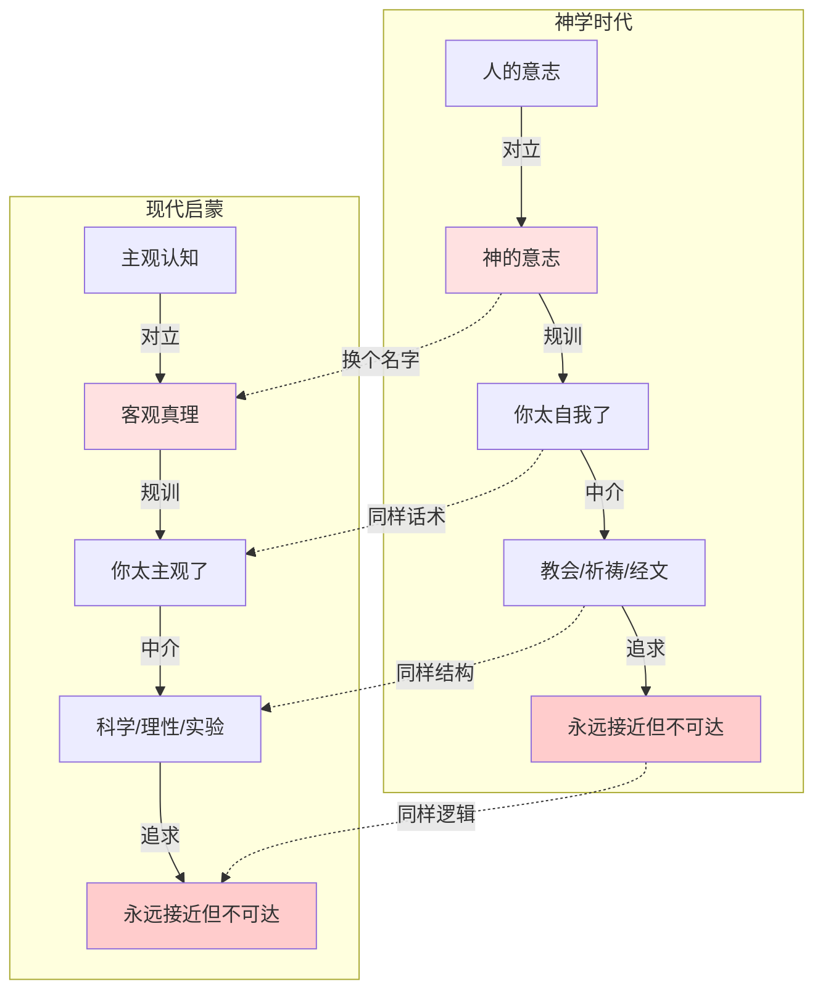
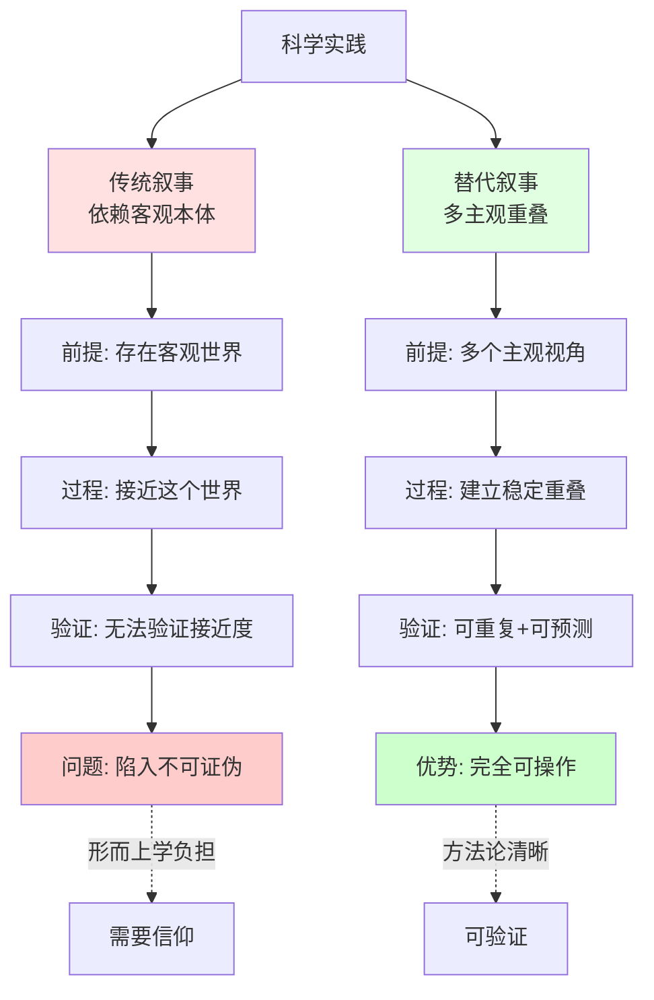
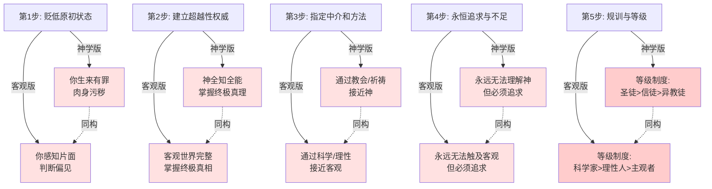

## 神学结构与客观崇拜核心洞察可视化

### 1. 神学结构与客观崇拜的同构性

### 2. 科学的两种叙事对比

### 3. 叙事的五步规训逻辑

## 核心要点

1. **权力结构未变**: 启蒙运动只是用"客观"替代"神"，压制个体经验的结构未变
2. **关键区分**: 客观本体（形而上学）vs 客观性标准（方法论）
3. **科学不依赖神学**: 可重复性、预测力等标准不需要"客观本体"假设
4. **回到原点**: 你的直接经验就是最基本的真实，不需要超越性权威验证
5. **建设性替代**: 用"多主观重叠+稳定性标准"替代"客观本体"

这章揭示了现代理性话语中隐藏的神学结构，是对认知权力的深刻批判。