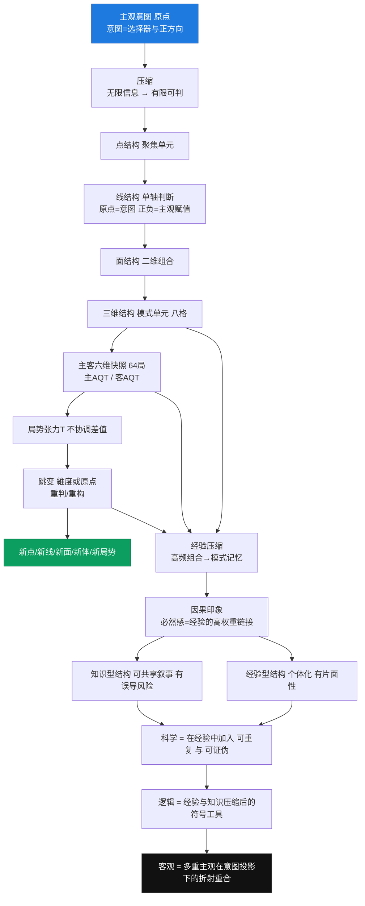

## 一、起点：为什么要谈“唯主观”

传统哲学与科学方法论，往往都在追寻“客观真理”。我们习惯相信，只要不断收集信息、不断总结规律，就能触碰到世界的本质。但正如《结构语言》的导论所揭示的：

- 我们看到的“客观”，其实永远嵌套在主观之中；
    
- 所谓科学的客观性，不过是“在特定意图和假设下形成的局部共识”；
    
- 我们并不能接触“真实世界本身”，只能接触到**被意图压缩和解压后的局部显现**。
    

因此，如果我们要建立一套真正能够解释人类认知的语言系统，就必须从**唯主观**出发。唯有如此，才能保证所有概念都有明确的锚点，不会陷入“伪客观”的幻觉。

---

## 二、第一条：真实世界不可触及，认知始于意图

> **是否有真实世界和真实世界如何是无法触及的，当前意图聚焦是我们认识的起点，也是过程，我们只能看到很小的面和部分。**

在结构语言里，**点结构**是最小的主观单元：

- 世界包含无限信息，但只有当意图聚焦某个对象时，它才会转化为“点”；
    
- 同一个对象，在不同意图下会成为完全不同的点。
    

进一步，当点被建立，我们的大脑会自动进入**线结构**：

- 它不是客观坐标轴，而是主观数轴；
    
- 原点由意图锚定，正方向由主观欲望决定。
    

点之后是面与三维结构：

- 多条判断线在同一意图下交叉，形成组合判断；
    
- 这些组合在经验中反复强化，就会沉积为模式印象。
    

**结论**：我们所说的“世界”，永远是意图下的切片。所谓全貌，并不存在于我们的认知中。

📌 **结构语言表达：一切认知始于意图点对结构的局部聚焦。**

---

## 三、第二条：经验是主观路径的跳变记忆

> **我们的经验知识结构来源于意图聚焦得到的局部因果印象的强化。**

经验并不是“忠实的记录”，而是主观在跳变中的压缩记忆：

- **因果印象**：在高频联结下，主观会把模式当作因果；
    
- **跳变强化**：成功或失败的跳变，都会在路径上留下深刻印记；
    
- **局部性**：不同意图下看到的因果完全不同，经验之间不可完全通约；
    
- **迁移性**：三维和主客结构常常跨场景迁移，成为“套模板式”的直觉。
    

所以，经验并不等于真理，而是**跳变轨迹的压缩**。

📌 **结构语言表达：经验结构是意图点上的路径跳变记忆，是结构压强留下的轨迹。**

---

## 四、第三条：外部结构只能以主观路径显现

> **外部结构也是被压缩成一个点后按照意图展开跳变到当前主观意图建立的局势上产生的主观变化。**

当我们谈论“外部世界对我的影响”时，其实隐含着几个步骤：

1. **压缩**：无限维度的信息被意图压缩成一个点；
    
2. **解压**：点在主观意图下被展开为线或局势；
    
3. **主客结构**：所谓“关系”也是我在六维坐标中重建的结果；
    
4. **跳变显现**：外部变化看似来自世界本身，但本质上是我在新的意图权重下的重判。
    

案例：在“假狗退货”事件中，市长热线并不直接存在于商家的世界，而是我通过语言模拟创造的“外部结构”，结果却真实地改变了局势。这正是外部结构只能通过主观投影显现的证明。

📌 **结构语言表达：外部结构只能在主观意图路径上跳变产生显现，所谓影响是“我视角”的显现。**

---

## 五、知识与经验的对照：主观共识的层级

如果一切都如此主观，那么交流与科学还有意义吗？答案是：有，但必须分层。

- **经验型结构**：个体直接经历形成，高度个体化，不可共享；
    
- **知识型结构**：叙事、故事、教育形成的共享模式，可传播，但容易误导；
    
- **科学**：一种特殊的经验型结构，强调可重复与可证伪，但依然不是终极真理；
    
- **逻辑**：并非世界的本源，而是经验与知识多次压缩后的迁移工具。
    

因此，所谓“客观知识”，其实是**多重主观在高频共识下的折射重合**。

---

## 六、最终命题：唯主观的整合表达

1. **客观不是不存在，而是总以主观路径显现。**
    
2. **经验不是真理，而是跳变轨迹的压缩。**
    
3. **知识与科学不是脱离主观，而是主观之间的高频共识。**
    

一句话总结：

> **客观，不过是多重主观在意图投影下的折射重合。**

---

## 七、价值与启发

唯主观的立场，并不是否认外部世界，而是提醒我们：

- 任何“客观”都必须经过主观压缩才能成立；
    
- 任何“经验”都必须经由跳变才能沉积；
    
- 任何“知识”都必须在共享中被不断检验；
    
- 任何“科学”都只是严格管理过的经验，而非终极真理。
    

这为我们带来三大启发：

1. **警惕幻觉**：不要把局部经验当成必然真理；
    
2. **善用跳变**：通过观察张力与阈值，把握主观显现的窗口；
    
3. **重视结构语言**：它不是新逻辑，而是让我们看清自己一直在使用的思维方式，并能加以优化和操控。
    

在不确定的世界里，唯主观不是退缩，而是唯一可靠的起点。

