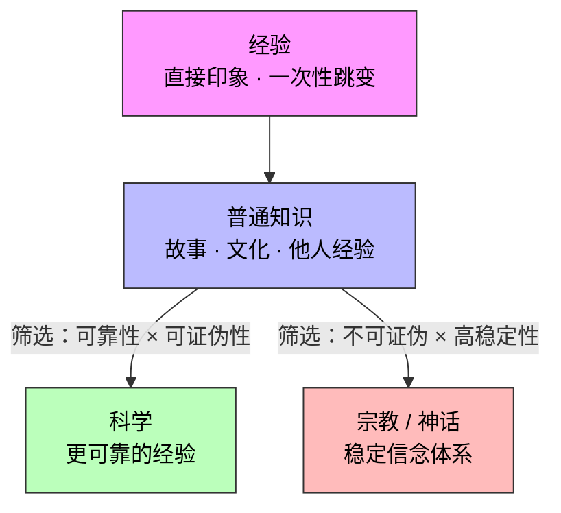

## 定义

- **经验型外部结构**：主体通过直接经历所形成的外部约束模型。
    
    - 特点：条件反射式，高度个体化，容易片面化。
        
- **知识型外部结构**：主体通过间接学习（故事、叙事、教育、文化输入）所形成的外部约束模型。
    
    - 特点：可共享，但存在被误导的风险。
        
- **科学**：一种特殊的经验型外部结构，满足 **可靠性**（可重复验证）与 **可证伪性**（允许反例推翻）。
    
    - 特点：更严格的经验管理方式，但仍然是主观产物。
        

---

## 公理

### 公理 1：共享性公理

- 知识型结构是可共享的，可以跨个体传递；
    
- 经验型结构高度个体化，只对经历者本人有效。
    

### 公理 2：误差公理

- 经验型结构受限于有限样本，容易片面化；
    
- 知识型结构受限于叙事传递，容易被误导；
    
- 科学虽强调验证，但依然不是绝对真理。
    

### 公理 3：嵌入公理

- 经验型结构更多嵌入在“组合”阶段（直觉性调用）；
    
- 知识型结构更多嵌入在“选择”阶段（理性参照）。
    

---

## 定理

### 定理 1：转化定理

- 别人的经验型结构 → 我只能先当作知识型结构吸收；
    
- 通过自身试错与验证 → 再转化为我的经验型结构；
    
- 当我的经验足够稳定、可归纳时 → 又能被压缩回知识型结构，进入共享库。
    

### 定理 2：科学公式定理

科学 = 经验型外部结构 × （可靠性 ∧ 可证伪性）。  
科学不是超越经验的真理，而是更严格的经验管理过程。

---

## 推论

1. **片面性推论**：个体经验受限于有限样本，必然片面。
    
2. **误导性推论**：知识型输入若未经验证，随时可能误导行为。
    
3. **有限真理推论**：科学虽更可靠，但依旧可能被反例推翻，只是“逼近规律”的方式。
    

---

## 结构形式对照

知识型与经验型结构，在六大层次的表现形式如下：

- **点结构**
    
    - 知识型：外部叙事激活的聚焦点（例如：“书上说自由市场提高效率”）。
        
    - 经验型：自身经历触发的聚焦点（例如：“我亲手尝试后效率真的提高”）。
        
- **线结构**
    
    - 知识型：借用外部逻辑推导出的判断（例如：“诚信 → 赢得尊重”）。
        
    - 经验型：直接结果形成的数轴判断（例如：“我因为诚信被信任 → +0.8”）。
        
- **面结构**
    
    - 知识型：用范式填充象限（例如：“聪明+撒谎=正面策略”）。
        
    - 经验型：根据真实结果修正象限（例如：“撒谎后被打 → 负面象限”）。
        
- **三维结构**
    
    - 知识型：三维逻辑组合（例如：“聪明+机智+勇敢 → 避免处罚”）。
        
    - 经验型：三维带情绪印记的模式（例如：“恐惧+撒谎+被揭穿 → 严重惩罚”）。
        
- **局势结构**
    
    - 知识型：稳定叙事的角色设定（例如：“父母=权威=惩罚”）。
        
    - 经验型：六维动态快照（例如：“父母情绪不稳 → 不适合坦白”）。
        
- **跳变结构**
    
    - 知识型：叙事被打破的时刻（例如：“我以为撒谎能脱罪”）。
        
    - 经验型：新模式被写入的时刻（例如：“撒谎反而加重惩罚 → 以后不再撒谎”）。
        

---

## 多次强化的后果

无论是知识型还是经验型结构，当被多次使用、强化后，会在思维中演化为更深层次的结构：

1. **方法论**：反复调用后成为问题解决模板（例如“遇事先撒谎试探反应”）。
    
2. **因果印象**：形成“默认因果链”，哪怕缺乏逻辑，也深信不疑（例如“被打=成长”）。
    
3. **相关性信念**：将无关信息建立习惯性联想（例如“穿红衣服=自信”）。
    

这些“结构沉积”最终决定了一个人处理信息与应对局势的模式，构成其“稳定认知形态”。

---

## 案例分析

### 案例 1：经验型外部结构（踢球打碎玻璃）

- **情境**：孩子在家中踢球时，不小心打碎了玻璃，意识到可能会挨骂。
    
- **经验调用**：他回忆起过去类似事件中“破坏 → 挨骂或处罚”的经历。
    
- **即时反应**：在害怕的情绪下，孩子启动了“隐瞒或逃避”的意图，选择不主动承认。
    
- **结构形成**：形成“破坏=惩罚”的经验型外部结构，进入未来的直觉判断库。
    
- **局限性**：这一经验高度个体化，可能只在父母情绪严厉时成立，并不具备普遍性。
    

### 案例 2：知识型外部结构（寓言/故事传递）

- **情境**：同一孩子听过一则故事，内容是某人因机智撒谎躲过惩罚，还被称赞聪明。
    
- **知识吸收**：这则故事成为孩子内部“撒谎=智慧=安全”的知识型结构。
    
- **缺乏验证**：由于并未发生在自己身上，这一知识并未经历经验层面的校验。
    
- **风险来源**：如果直接套用这个知识，可能与实际环境不符，导致误判。
    

### 案例 3：科学（自由落体实验）

- **历史背景**：古希腊亚里士多德认为重物比轻物落得更快。
    
- **伽利略的实验**：他在比萨斜塔进行自由落体实验，发现重物与轻物同时落地，推翻了古说。
    
- **科学特性**：这一结果能被反复验证（可靠性）且具有可被反证的条件（可证伪性）。
    
- **注意点**：即使如此，这一知识仍是大量经验的压缩，不代表终极真理（如量子尺度下不再成立）。
    

### 案例 4：寓言带来的错误策略

- **知识型输入**：孩子从故事中学到“机智地撒谎可以避免惩罚”。
    
- **情境触发**：有一天他又打碎了玻璃，这次他选择照着故事行动 → 谎称是邻居小孩所为。
    
- **跳变触发**：父母调查后发现破绽，孩子被揭穿。
    
- **结果反转**：原本想“避开惩罚”，反而招来更重的斥责与不信任。
    
- **经验重写**：孩子内部的知识型结构被打碎，改写为新的经验型结构：“撒谎会有更严重后果”。
    
- **结论启示**：知识型结构若无经验验证，可能误导行为；唯有通过失败与校正，才能转化为稳定的经验型结构。
    

---

## 逻辑的起源与局限

逻辑并不是独立存在的真理，而是**经验与知识在反复强化后的产物**。

- **起源**
    
    - 多次重复的经验 → 沉积为“因果印象”。
        
    - 知识叙事抽象化 → 形成“形式规则”。
        
    - 逻辑的本质，就是把局部经验冻结为可迁移的模式。
        
- **局限**
    
    - 逻辑保证的是形式正确，而非现实真实。
        
    - 它依赖的前提，本身就是主观设定或文化约定。
        
    - 不同文化强化不同逻辑训练（西方形式推理 vs 东方辩证判断）。
        
- **价值**
    
    - 逻辑提供了跨领域的推理框架，可以脱离原始经验。
        
    - 它是科学和数学的核心工具，但其根基依然是经验与知识的沉积。
        

逻辑不是世界的本源，而是人类大脑的“高效认知压缩算法”：它起源于经验，经由知识叙事抽象化，最终在符号体系中获得迁移力。

---

##  一句话总结

**经验型结构给我们直觉，知识型结构给我们叙事，科学是更严格的经验管理方式，而逻辑则是经验与知识反复强化后的压缩与迁移工具；四者相互转化，共同塑造了我们在不确定世界中的思维与行动。**